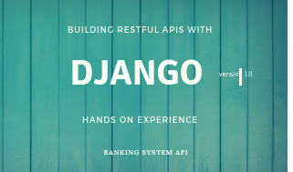

# Building.RESTfulAPIs.with.Django.1.11
[

We're going to take you step-by-step to build a modern, fully open-source,Banking System RESTful API using Python, Django Rest Framework.

This course will teach you exactly how to build one with Django, Python, Django Rest Framework, and more.

### Section 1| Django start project
*1 - Requirements: no code*

[2 - Blank Django Project](../../tree/add_commit_here/)

### Section 2| Django Rest Framework

*1 - Introduction: no code*

[2 - Install Django Rest Framework](../../tree/add_commit_here/)

[3 - Status Model & App](../../tree/add_commit_here/)

[4 - Model Form for Validation](../../tree/add_commit_here/)

[5 - Creating a Serailizer](../../tree/add_commit_here/)

[6 - Create & Update through Serializers](../../tree/add_commit_here/)

[7 - Validation & Fields](../../tree/add_commit_here/)

[8 - API Endpoints Overview](../../tree/add_commit_here/)

[9 - List & Search API View](../../tree/add_commit_here/)

[10 - Create API View](../../tree/add_commit_here/)

[11 - Detail API View](../../tree/add_commit_here/)

[12 - Update & Delete API Views](../../tree/add_commit_here/)

[13 - Mixins to Power Http Methods](../../tree/add_commit_here/)

[14 - One API Endpoint for CRUDL](../../tree/add_commit_here/)

[15 - One API Endpoint for CRUDL Part 2](../../tree/add_commit_here/)

[16 - Uploading & Handling Images](../../tree/add_commit_here/)

[17 - 2 Views for CRUDL](../../tree/add_commit_here/)

[18 - Authentication & Permissions](../../tree/add_commit_here/)

[19 - Global Settings for Authentication & Permissions](../../tree/add_commit_here/)

[20 - Permission Tests with Python Requests](../../tree/add_commit_here/)

[21 - Implement JWT Authentication](../../tree/add_commit_here/)

[22 - JWT Authorization Header](../../tree/add_commit_here/)

[23 - Custom JWT Response Payload Handler](../../tree/add_commit_here/)

[24 - Custom Authentication View](../../tree/add_commit_here/)

[25 - Register API View](../../tree/add_commit_here/)

[26 - User Register Serializer](../../tree/add_commit_here9/)

[27 - Serializer Method Field](../../add_commit_here/)

[28 - Get Context Data](../../tree/add_commit_here/)

[29 - Custom Permissions](../../tree/add_commit_here/)

[30 - Is Owner or Read Only Permission](../../tree/add_commit_histor/)

[31 - Nested Serializer Part 1](../../tree/add_commit_histor/)

[33 - Nested Serializer Part 2 & 3](../../tree/add_commit_histor/)

[34 - Pagination to Manage Request Load](../../tree/add_commit_history/)

[35 - Search Filter & Ordering](../../tree/add_commit_histor/)

[36 - Reverse URLs with DRF](../../tree/add_commit_historb/)

[37 - Serializer related fields](../../tree/add_commit_histor/)
d
[38 - Automated Testing](../../tree/add_commit_history/)

[39 - Testing User API](../../tree/add_commit_histor/)

[41 - Testing with a Temporary Image](../../tree/add_commit_histor/)

*42 - Final wrap-up: no code*
